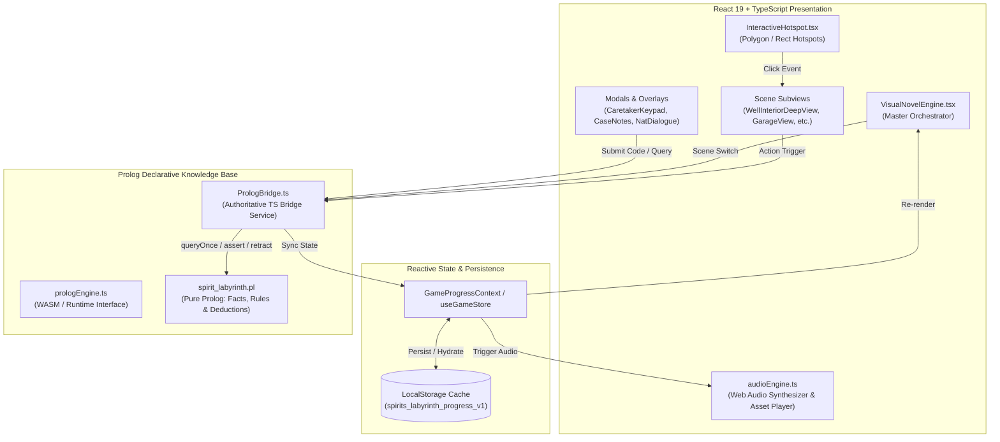
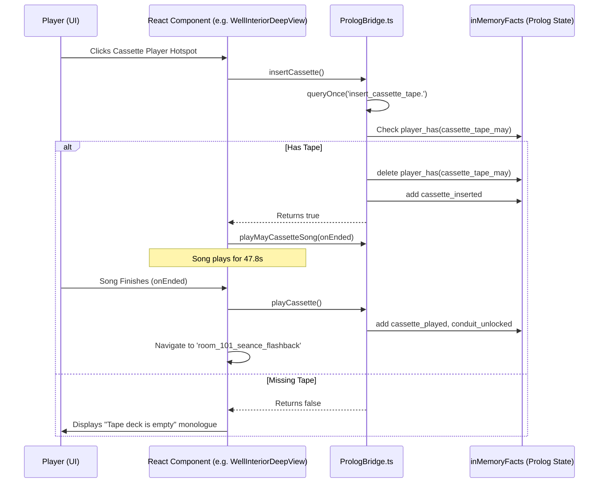
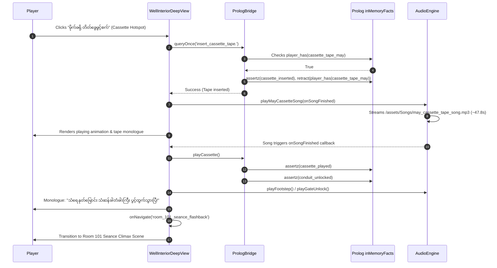

# Architecture & Prolog Logic Guide: The Hostel (Hostel 1998)

> Comprehensive technical explanation of the frontend architecture, TypeScript implementation, state management, procedural audio, and the Prolog declarative knowledge base (facts, rules, predicates, and bridge integration).

---

## 1. Executive Summary & Architectural Overview

**The Hostel** combines modern reactive web architecture with classical logic programming:
1. **Frontend Layer (React 19 + TypeScript + Vite + Tailwind CSS 4)**: Handles UI rendering, cinematic visual novel presentation, interactive hotspot detection, audio synthesizing, animations, and player inputs.
2. **Logic & Rule Engine (Prolog + PrologBridge)**: Acts as the authoritative state machine and truth verification core. It governs causality, item dependencies, room traversal permissions, puzzle validation, and mystery deductions.



---

## 2. Frontend & TypeScript Architecture

### 2.1 File Structure Breakdown

```
The-Hostel/
├── spirit_labyrinth.pl        # Core Prolog Knowledge Base (Facts & Rules)
├── dev_terminal_test.pl       # Standalone terminal test suite
├── public/
│   └── assets/                # Backgrounds, character portraits, items & songs
│       ├── characters/        # Character visual novel portraits (PNG)
│       ├── items/             # Inventory item icons
│       ├── scenes/            # Room backgrounds (JPG)
│       ├── Songs/             # Ambient & narrative music (MP3)
│       └── ui/                # Clue cards, compass, border artwork
├── src/
│   ├── components/            # React View Components & Modals
│   │   ├── VisualNovelEngine.tsx     # Master Scene & Chapter Orchestrator
│   │   ├── InteractiveHotspot.tsx    # Clickable hotspot layer (points & coords)
│   │   ├── WellInteriorDeepView.tsx  # Chapter 3 deep well & cassette climax
│   │   ├── GarageSubterraneanView.tsx# Chapter 3 garage & drain puzzle
│   │   ├── GarageValveMiniGame.tsx   # Interactive spacebar valve mini-game
│   │   ├── CaretakerOfficeView.tsx   # Office exploration & spectral scare
│   │   ├── CaretakerKeypadModal.tsx  # Mechanical padlock combination lock
│   │   ├── Room101SeanceClimaxView.tsx # Chapter 3 finale & seance sequence
│   │   ├── PrayerAltarView.tsx       # Chapter 2 Nat altar & candle ritual
│   │   ├── NatDialogueView.tsx       # Guardian Nat truth/lie interrogation
│   │   ├── CaseNotesModal.tsx        # Clues journal & deduction notebook
│   │   ├── DeskInspectionView.tsx    # Chapter 1 Room 4B desk search
│   │   └── ...
│   ├── services/
│   │   └── PrologBridge.ts    # Authoritative TypeScript <-> Prolog Bridge
│   ├── logic/
│   │   └── prologEngine.ts    # Prolog runtime stub & query signatures
│   ├── store/
│   │   └── useGameStore.ts    # Store re-exports
│   ├── context/
│   │   └── GameProgressContext.tsx   # React context & reducer for state
│   ├── utils/
│   │   ├── audio.ts           # Audio engine export proxy
│   │   └── assets.ts          # Safe asset path resolution
│   ├── audioEngine.ts         # Procedural Web Audio API synthesizer
│   ├── characterData.ts       # Playable investigator character archetypes
│   ├── gameData.ts            # Scene backgrounds, items & inspection metadata
│   ├── gameStore.ts           # Chapter state reducers, defaults & rollover
│   ├── natKnowledge.ts        # Nat topic registry, truth claims & dialogue
│   └── types.ts               # Core TypeScript type definitions & interfaces
```

### 2.2 Master Orchestrator: `VisualNovelEngine.tsx`
`VisualNovelEngine.tsx` is the primary controller:
- **Phase & Scene Routing**: Controls whether the game is displaying Chapter 1 (Room 4B Escape), Chapter 2 (East & West Wings, Altar, Caretaker Office), or Chapter 3 (Courtyard, Garage, Banyan Well, Seance Climax).
- **HUD & Vitals Monitoring**: Renders the dynamic 1998 analog clock, composure/sanity meter with color-coded warning states, and quickslot inventory bar.
- **Monologue & Dialogue Dispatch**: Renders Myanmar Unicode 5.1+ narrative captions and character dialogues.
- **Audio Coordination**: Manages scene transition sound effects, ambient loops, and jump-scares.

### 2.3 Interactive Hotspot System: `InteractiveHotspot.tsx`
Hotspots handle point-and-click interactions across static background art:
1. **Polygon Coordinates (`polygonPoints="x1,y1 x2,y2 ..."`):** Rendered as SVG polygon overlays converted to percentages (`0%` to `100%`), allowing precise irregular click zones (such as a cassette player on the ground or wellhead roots).
2. **Bounding Box Coordinates (`x, y, width, height`):** Rectangular percentages for doors, drawers, and gates.
3. **Dynamic Feedback**: Computes contextual tooltips (`cursorTooltip`) based on current Prolog facts (e.g., changing from *"[တိတ်ခွေထည့်မည်]"* to *"[တိတ်ခွေဖွင့်မည်]"* once the cassette is in the player).

### 2.4 State Management & Chapter Rollover
Game state is managed through `GameProgressContext.tsx` and `gameStore.ts`:
- **Active Save (`spirits_labyrinth_active_save`)**: Stores immediate location, open sub-scene, composure, remaining seconds, and unspent clues.
- **Chapter Progress (`spirits_labyrinth_progress_v1`)**: Stores highest unlocked chapter, overall completion flags, and narrative endings.
- **Chapter Rollover**: When advancing from Chapter 1 $\rightarrow$ 2 $\rightarrow$ 3:
  - Remaining time from the previous chapter banks into the next chapter's countdown.
  - Composure carries over with archetype recovery bonuses applied (`apply_relief_recovery`).
  - Key puzzle items persist in the player's inventory while chapter-specific junk is pruned.

### 2.5 Procedural Audio Synthesizer: `audioEngine.ts`
Rather than relying solely on large audio files, `audioEngine.ts` synthesizes 1998 atmospheric soundscapes directly using the **Web Audio API**:
- **Binaural Rain & Drone**: White noise buffer nodes filtered through multi-stage biquad filters coupled with 108Hz low sine oscillators.
- **Procedural SFX**: Dynamic mathematical generation of hollow chimes, footstep shuffles, heavy iron gate screeches, paper rustles, heartbeat throbs, and jump-scares.
- **Asset Audio Streaming**: Dedicated methods like `playMayCassetteSong()` stream real audio (`/assets/Songs/may_cassette_tape_song.mp3`), handling volume ducking, mute toggling, and completion callbacks (`ended` event).

---

## 3. How Prolog is Working (Logic Engine & Bridge)

### 3.1 Why Prolog?
In adventure and visual novel games, state quickly becomes tangled in flag spaghetti (e.g. `if (hasKey && doorLocked && !rootsCut && pulleyMounted)`). 

Prolog solves this through **declarative logic**:
- You declare **facts** (what is currently true about the world).
- You declare **rules** (the preconditions required for an event or state to become true).
- You pose **queries** (`?- well_descent_ready.`), and Prolog's inference engine automatically evaluates whether all preconditions are satisfied.

### 3.2 The Authoritative Bridge: `PrologBridge.ts`
`PrologBridge.ts` acts as the single source of truth between the React UI and Prolog:

```typescript
// Example from PrologBridge.ts:
class PrologBridgeService {
  private inMemoryFacts: Set<string> = new Set([...]);
  private state: PrologBridgeState = { ... };

  async queryOnce(query: string): Promise<boolean> { ... }
  async query(query: string): Promise<PrologQueryResult> { ... }
  async insertCassette(): Promise<boolean> { ... }
  async playCassette(): Promise<boolean> { ... }
  // ...
}
```

### 3.3 Query Parsing & Execution Cycle



1. **Compound Clause Parsing (`splitPrologClauses`)**:
   Splits queries like `retractall(current_chapter(_)), assertz(current_chapter(3)), assertz(stairway_gate_unlocked).` into atomic operations while respecting nested parentheses.
2. **Dynamic Retract (`retractall`)**:
   Cleans up old state facts (e.g. removing old chapter numbers or dropping an item from inventory).
3. **Dynamic Assert (`assertz` / `assert`)**:
   Introduces newly acquired knowledge or progress milestones into the active knowledge base.
4. **Hydration from LocalStorage (`hydrateFromStorage`)**:
   On page refresh or save/load, the bridge reads browser storage and reconstructs the Prolog fact database (`inMemoryFacts`).

---

## 4. Prolog Rules and Facts: Deep Dive

### 4.1 What are Facts?
**Facts** are fundamental, unconditional assertions about the game universe. In Prolog syntax, a fact ends with a period (`.`):

```prolog
predicate(argument1, argument2, ...).
```

#### Categories of Facts in *The Hostel*:

| Category | Prolog Syntax Example | Meaning / Usage | Where Used |
|---|---|---|---|
| **Immutable Truths** | `spirit_fact(victim_name, mama_may).`<br/>`spirit_fact(true_killer, sandar).`<br/>`spirit_fact(true_cause, strangled).` | Ground truth of the 1998 murder. Cannot be modified by gameplay. | `spirit_labyrinth.pl` (Final accusation evaluation) |
| **Character Stats** | `investigator_stat(thura, fear_resistance, 1.2).`<br/>`investigator_stat(aye_aye, composure_decay, 0.8).` | Base psychological profiles and multipliers for chosen protagonist. | `spirit_labyrinth.pl`, `characterData.ts` |
| **Dynamic World State** | `current_location(well_interior_deep).`<br/>`garage_drained.`<br/>`conduit_unlocked.` | Current state of the environment. Added or removed during play. | `PrologBridge.ts`, `WellInteriorDeepView.tsx` |
| **Inventory Facts** | `player_has(iron_pulley).`<br/>`player_has(cassette_tape_may).` | Current possessions in the player's rucksack. | `PrologBridge.ts`, `gameStore.ts`, UI quickslots |
| **Door & Lock States** | `door_state(room_4b_door, locked).`<br/>`locker_unlocked(14).`<br/>`stairway_gate_unlocked.` | Physical access barriers preventing traversal until solved. | `VisualNovelEngine.tsx`, `StairwayGateInspectionView.tsx` |

---

### 4.2 What are Rules?
**Rules** are conditional assertions. A rule specifies that a fact (**Head**) is true **IF** one or more conditions (**Body**) are true. The symbol `:-` represents **"if"**, and commas (`,`) represent logical **AND**:

```prolog
Head :-
    Condition1,
    Condition2,
    Condition3.
```

#### Key Rules in *The Hostel*:

#### Rule 1: Well Descent Readiness (`well_descent_ready/0`)
Before the player can climb down the dry well into the underground waterway in Chapter 3, three prerequisites must all be satisfied:
```prolog
well_descent_ready :-
    well_roots_severed,
    well_pulley_rigged,
    well_rope_rigged.
```
- **How it is used**: When the player clicks on the well opening, `PrologBridge.queryOnce('well_descent_ready.')` is evaluated. If any of the three facts is missing, the player is barred from descending, and the monologue indicates what is still missing.

#### Rule 2: Item Acquisition Conditions (`can_take_garage_item/1`)
In Chapter 3, items in the flooded garage (machete and iron pulley) can only be picked up if the water has been pumped out:
```prolog
can_take_garage_item(Item) :-
    member(Item, [iron_pulley, rusty_machete]),
    garage_drained,
    \+ player_has(Item).
```
- **How it is used**: `GarageSubterraneanView.tsx` invokes `canTakeGarageItem('iron_pulley')`. If `garage_drained` is not yet asserted (via the spacebar valve mini-game), picking up the item is prohibited.

#### Rule 3: Traversal Constraints (`can_traverse/2`)
Controls valid movements between physical and metaphysical rooms:
```prolog
can_traverse(well_interior_deep, room_101_seance_flashback) :-
    conduit_unlocked.

can_traverse(stairwell_gate, hostel_outer_grounds) :-
    stairway_gate_unlocked.
```
- **How it is used**: When attempting room transitions in `VisualNovelEngine.tsx`, the bridge queries `can_traverse(From, To)` to prevent skipping sequence steps.

#### Rule 4: Nat Interrogation: Paired Truth/Lie Verification (`evaluate_nat_query/3`)
The Guardian Nat speaks in **pairs of claims**, where exactly one is true and one is false:
```prolog
nat_knows(altar_rite, claim_a, "Light 3 black candles and ring the bronze bell once.").
nat_knows(altar_rite, claim_b, "Pour stagnant well water over the central threshold.").

evaluate_nat_query(Topic, ClaimId, valid) :-
    nat_knows(Topic, ClaimId, Text),
    spirit_fact(Topic, ClaimId), !.

evaluate_nat_query(Topic, ClaimId, deceptive) :-
    nat_knows(Topic, ClaimId, _),
    assertz(used_unverified_claim(Topic, ClaimId)).
```
- **How it is used**: In `NatDialogueView.tsx`, selecting an unverified claim tests the player's deduction skills. Trusting the lie reduces composure and sets the `deceived` flag in the game ending matrix.

#### Rule 5: Endgame Resolution Rules (`ending_resolution/1`)
Evaluates the final narrative outcome:
```prolog
ending_resolution(true_rest) :-
    accused_killer(sandar),
    accused_cause(strangled),
    accused_location(dried_well),
    \+ used_unverified_claim(_, _),
    player_composure(C), C > 0.

ending_resolution(deceived) :-
    used_unverified_claim(_, _).

ending_resolution(composure_zero) :-
    player_composure(0).
```

---

## 5. End-to-End Workflow Example: Chapter 3 Well & Cassette Puzzle

Here is the complete lifecycle of how frontend, TypeScript, and Prolog interact for the cassette tape puzzle:



---

## 6. Summary Reference Table

| Feature | Frontend File (React/TS) | Prolog File / Bridge Hook | Core Rule / Fact |
|---|---|---|---|
| **Room 4B Escape** | `DeskInspectionView.tsx`<br/>`VisualNovelEngine.tsx` | `PrologBridge.ts`<br/>`spirit_labyrinth.pl` | `has_item(small_brass_key)` $\rightarrow$ `unlock_exit_door` |
| **Altar Awakening** | `PrayerAltarView.tsx` | `can_perform_altar_rite/0` | `altar_candle_count(3)`, `altar_bell_placed(true)` |
| **Nat Audience** | `NatDialogueView.tsx` | `evaluate_nat_query/3` | `nat_knows/3`, `used_unverified_claim/2` |
| **Caretaker Padlock** | `CaretakerKeypadModal.tsx` | `attempt_caretaker_combination/1` | Combination `290418` $\rightarrow$ `caretaker_door(unlocked)` |
| **Garage Drainage** | `GarageValveMiniGame.tsx`<br/>`GarageSubterraneanView.tsx` | `drain_garage/0`<br/>`can_take_garage_item/1` | Spacebar valve 100% $\rightarrow$ `garage_drained` |
| **Well Rigging** | `BanyanWellheadView.tsx` | `well_descent_ready/0` | `well_roots_severed`, `well_pulley_rigged`, `well_rope_rigged` |
| **Cassette Climax** | `WellInteriorDeepView.tsx` | `insert_cassette_tape/0`<br/>`play_cassette_tape/0` | Tape song (47.8s) $\rightarrow$ `conduit_unlocked` $\rightarrow$ Seance Climax |

---
